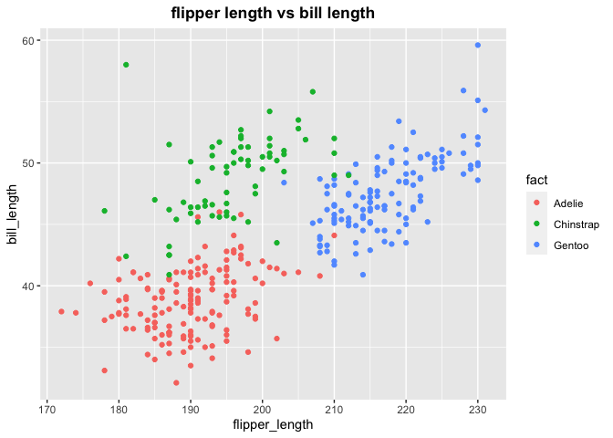

R Notebook
================

``` r
# libraries
library(tidyverse)
```

    ## ── Attaching packages ─────────────────────────────────────── tidyverse 1.3.1 ──

    ## ✓ ggplot2 3.3.3     ✓ purrr   0.3.4
    ## ✓ tibble  3.1.0     ✓ dplyr   1.0.5
    ## ✓ tidyr   1.1.3     ✓ stringr 1.4.0
    ## ✓ readr   1.4.0     ✓ forcats 0.5.1

    ## ── Conflicts ────────────────────────────────────────── tidyverse_conflicts() ──
    ## x dplyr::filter() masks stats::filter()
    ## x dplyr::lag()    masks stats::lag()

``` r
library(palmerpenguins)
library(ggplot2)
```

Problem 1

``` r
set.seed(123)
df <- tibble(
  x_1 = rnorm(10, sd = 1),
  x_2 = x_1 > 0,
  x_3 = c("a","b","c","d","e","f","g","h","i","j"),
  x_4 = factor(c("1","2","3","2","3","1","1","3","2","1"))
)
mean_num = mean(pull(df,x_1))
mean_log = mean(pull(df,x_2))
mean_char = mean(pull(df, x_3))
```

    ## Warning in mean.default(pull(df, x_3)): argument is not numeric or logical:
    ## returning NA

``` r
mean_fact = mean(pull(df, x_4))
```

    ## Warning in mean.default(pull(df, x_4)): argument is not numeric or logical:
    ## returning NA

The means are shown as: 0.0746256; 0.5; NA; NA.  
Mean of **numeric and logical vectors** can be calculated while mean of
**character vector and factor vector** cannot be calculated. And thus,
we got NAs for these two columns.

``` r
as.numeric(df$x_2)
```

    ##  [1] 0 0 1 1 1 1 1 0 0 0

``` r
as.numeric(df$x_3)
```

    ## Warning: NAs introduced by coercion

    ##  [1] NA NA NA NA NA NA NA NA NA NA

``` r
as.numeric(df$x_4)
```

    ##  [1] 1 2 3 2 3 1 1 3 2 1

Logical vectors can be converted to numeric form with values 0 and 1;
character values cannot be converted to numeric forms and thus return
NAs; factor values can be converted to numeric forms according to their
levels.  

Problem 2

``` r
data("penguins", package = "palmerpenguins")
summary(penguins)
```

    ##       species          island    bill_length_mm  bill_depth_mm  
    ##  Adelie   :152   Biscoe   :168   Min.   :32.10   Min.   :13.10  
    ##  Chinstrap: 68   Dream    :124   1st Qu.:39.23   1st Qu.:15.60  
    ##  Gentoo   :124   Torgersen: 52   Median :44.45   Median :17.30  
    ##                                  Mean   :43.92   Mean   :17.15  
    ##                                  3rd Qu.:48.50   3rd Qu.:18.70  
    ##                                  Max.   :59.60   Max.   :21.50  
    ##                                  NA's   :2       NA's   :2      
    ##  flipper_length_mm  body_mass_g       sex           year     
    ##  Min.   :172.0     Min.   :2700   female:165   Min.   :2007  
    ##  1st Qu.:190.0     1st Qu.:3550   male  :168   1st Qu.:2007  
    ##  Median :197.0     Median :4050   NA's  : 11   Median :2008  
    ##  Mean   :200.9     Mean   :4202                Mean   :2008  
    ##  3rd Qu.:213.0     3rd Qu.:4750                3rd Qu.:2009  
    ##  Max.   :231.0     Max.   :6300                Max.   :2009  
    ##  NA's   :2         NA's   :2

``` r
n_row = nrow(penguins)
n_col = ncol(penguins)
# strip NA values before calculating mean
m_flipper = mean(penguins$flipper_length_mm, na.rm = TRUE)
```

The penguins dataset contains **344 rows and 8 columns**. The variables
are: species, island, bill\_length\_mm, bill\_depth\_mm,
flipper\_length\_mm, body\_mass\_g, sex, year. There are overall **3
species on 3 islands**, summary statistics are displayed in the table
above.  
The mean of flipper length in mm is **200.9152047**.

``` r
plot_df <- tibble(
  flipper_length = penguins$flipper_length_mm,
  bill_length = penguins$bill_length_mm,
  fact = factor(penguins$species)
)
ggplot(plot_df, aes(x = flipper_length, y = bill_length, color = fact)) + geom_point() + labs(title = "flipper length vs bill length") + theme(plot.title = element_text(face = "bold", hjust = 0.5))
```

    ## Warning: Removed 2 rows containing missing values (geom_point).

<!-- -->

``` r
ggsave("hw1_scatterplot.png", width = 5, height = 5)
```

    ## Warning: Removed 2 rows containing missing values (geom_point).
